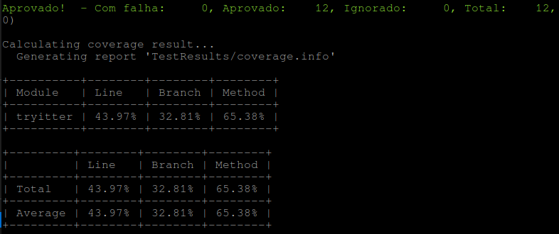
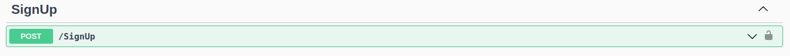
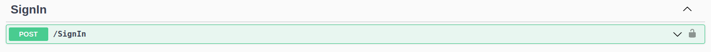
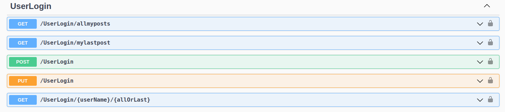
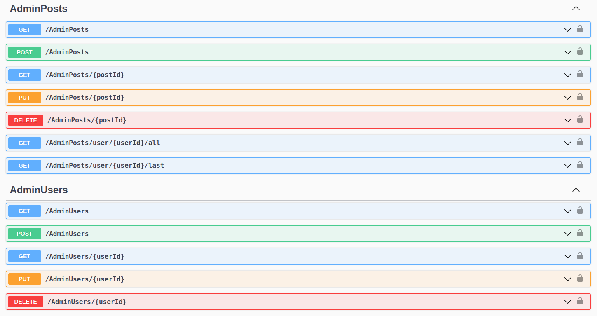

# Projeto Tryitter

#### Olá, esse é o repositório do meu projeto final da Acelaração 'C# - do zero ao deploy' - Trybe/XPInc. Seja bem-vind@!

Seguindo os requisitos propostos no desafio técnico, foi desenvolvida uma API utilizando o framework ASP.NET Core. Para o banco de dados foi utilizado um servidor SQL Server na Azure e a ORM utilizado foi o Entity Framework. Para os testes foram utilizados os frameworks xUnit e FluentAssertions. 

Importante: várias melhorias e possibilidades de refatorações já foram mapeadas e serão implementadas em breve. Sugestões sempre são bem-vindas!

 > A API e os endpoints foram documentados com o `Swagger` e podem ser acessados no seguinte endereço:

 >  https://tryitterventurin.azurewebsites.net/swagger/index.html

 

  
<strong>💻 Principais Tecnologias e bibliotecas utilizadas</strong>

  
- C#
- xUnit
- Asp.NET
- SQL Server
- Entity Framwork
- Fluent Assertions
- Microsoft Azure Cloud

   

  
<strong>🔧 Instalação e execução</strong>

>1. Clone o repositório: `git clone git@github.com:venturinn/final-project-c-sharp.git`.

>2. Rode o container que possui o servidor SQL Server com o comando: `docker-compose up`. A string de conexão com o banco, presente no arquivo TryitterContext.cs, deve ser alterada com os dados de conexão do banco local.

>3. Restaure o projeto: `dotnet restore`.

>4. Execute as Migration com o comando: `dotnet ef database update  `.

>6. Inicie a aplicação executando o comando: `dotnet run` no diretório do projeto.

   

  
<strong>🚀 Deploy</strong>

  
 > O deploy da aplicação foi realizado no [Azure](https://azure.microsoft.com/pt-br/). Para o deploy do banco de dados foi utilizado um servidor SQL Server no Azure também. 

 > Para facilitar o deploy de novas features, habilitei a implantação contínua da minha aplicação (CD) com a branch <strong>azure</strong> desse repositório. A branch main não pode ser utilizada para essa função, pois possui o projeto xUnit com os testes também, além do projeto da API, com isso a estrutura de pastas dessa branch impediu que o deploy fosse realizado com sucesso na Azure.
  
 > Os endpoints em deploy pode ser consultados e <strong>testados</strong> no seguinte endereço: https://tryitterventurin.azurewebsites.net/swagger/index.html.

 > Parte dos enpoints possuem autenticação, com isso, após o cadastro de um novo usuário no endpoint /SignUp, um JWT Token deve ser adquirido no enpoint /SignIn.
  
   

  
<strong>✅ Testes </strong>

  
 > A aplicação possui a seguinte cobertura de testes:
  
 
 
 > Os testes podem ser rodados por meio do comando `dotnet test`. É possível averiguar a cobertura utilizando o comando `dotnet test /p:CollectCoverage=true /p:CoverletOutput=TestResults/ /p:CoverletOutputFormat=lcov`.
 
   

  
<strong>👉 Estrutura Principal dos endpoints </strong>

  ### Cadastro de um novo usuário:

  > Para o cadastro de um novo usuário no sistema, o endpoint /SignUp deve ser usado. Será checado se o nome e o e-mail estão disponíveis e caso não estejam uma mensagem de erro será retornada. Essa rota não possui autenticação.

   

  ### Login de um usuário:

  > Para a realização do login, deve-se utilizar a rota /SignIn e caso as credenciais estejam corretas um JWT Token será retornado e deverá ser utilizado para acessar os demais endpoints da aplicação. Essa rota não possui autenticação.

   

  ### Grupo de endpoints do usuário:

  > Os enpoints abaixo exigem um JWT Token com autorização de usuário e será por meio desse token que a aplicação identificará a identidade do usuário que está acessando as rotas. O usuário possui autorização para realizar posts apenas na sua conta. Posts de outros usuários podem apenas ser consultados. 

   

  ### Grupo de endpoints do administrador:

  > Os enpoints abaixo exigem um JWT Token com autorização de administrador e por meios dessas rotas é possível realizar edições, exclusões e edições ilimitadas nos registros dos usuários e seus posts. Para os testes dessas rotas, segue o login do administrador:  `email: adm@email.com / password: adm@123`

   
  
   

 
Projeto desenvolvido por Diego Venturin. 😉

